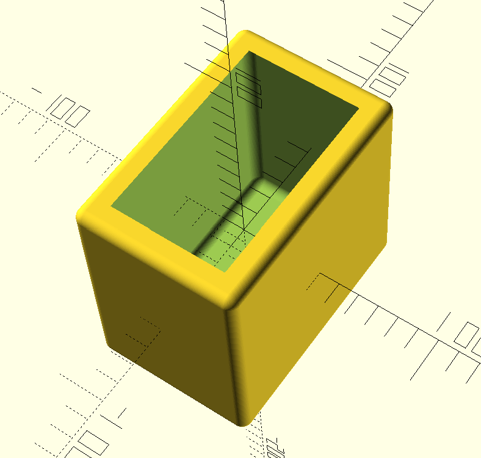
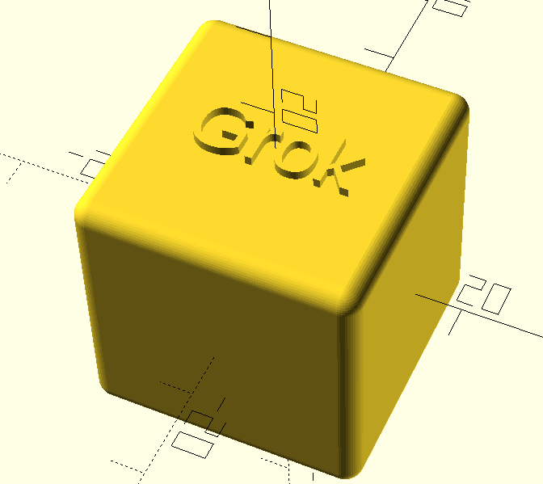
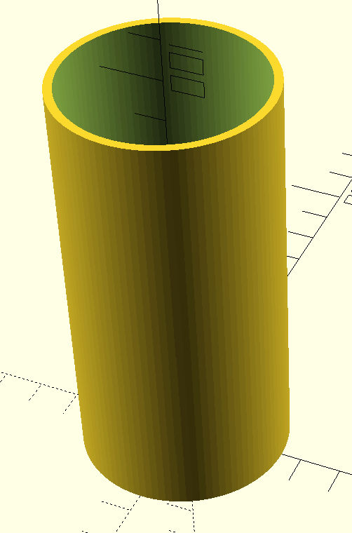

# AI-Generated 3D Models with Grok and OpenSCAD

This project demonstrates how to use generative AI (specifically Grok) to create parametric 3D models using OpenSCAD for 3D printing. The project aims to bridge the gap between natural language descriptions and 3D printable models.

## 🚀 Features

- Natural language to OpenSCAD code conversion using Grok
- Parametric 3D model generation
- Ready-to-print STL file output
- Example models and use cases
- Comprehensive documentation
- Command-line interface for quick generation

## 📋 Prerequisites

- OpenSCAD (latest version) - [Download here](https://openscad.org/downloads.html)
- Access to Grok AI - [Get access here](https://grok.x.ai)
- Python 3.8+ - [Download here](https://www.python.org/downloads/)
- Git - [Download here](https://git-scm.com/downloads)

## 🛠️ Installation

1. Clone this repository: 
```bash
git clone https://github.com/fr0g-66723067/grok-to-stl.git
cd grok-to-stl
```

2. Create and activate a virtual environment (recommended):
```bash
# On Windows
python -m venv venv
venv\Scripts\activate

# On macOS/Linux
python3 -m venv venv
source venv/bin/activate
```

3. Install the package:
```bash
pip install -e .
```

4. Set up your Grok API key:
   - Get your API key from [Grok](https://grok.x.ai)
   - Create a `.env` file in the project root
   - Add your API key:
     ```
     GROK_API_KEY=your_api_key_here
     ```

5. Verify installation:
```bash
grok-to-stl --help
```

## 📖 Documentation

See the [docs](./docs) directory for comprehensive documentation including:
- Getting Started Guide
- API Reference
- Example Projects
- Best Practices
- Troubleshooting Guide

## 🎯 Quick Start

### Using Python API

```python
from grok_openscad import GrokOpenSCAD

# Initialize the generator
try:
    generator = GrokOpenSCAD()  # Will use GROK_API_KEY from .env file
except ValueError as e:
    print(f"Error: {e}")
    print("Make sure you've set up your GROK_API_KEY in the .env file")
    exit(1)

# Generate a simple model
try:
    scad_code = generator.generate("Create a cylindrical vase with a height of 100mm and diameter of 50mm")
    generator.save_to_file("vase.scad")
    print("Model generated successfully!")
except Exception as e:
    print(f"Error generating model: {e}")
```

### Using Command Line

1. Generate an example model:
```bash
grok-to-stl --example cube --output cube.scad
```

2. Verify the generated file:
```bash
# On Windows
type cube.scad

# On macOS/Linux
cat cube.scad
```

3. Preview in OpenSCAD:
```bash
# On Windows
start cube.scad  # Will open with OpenSCAD if it's installed

# On macOS
open cube.scad

# On Linux
xdg-open cube.scad
```

4. Convert to STL:
```bash
openscad -o cube.stl cube.scad
```

### Troubleshooting

If you encounter issues:

1. Verify your API key is set:
```bash
# Check if .env file exists
ls .env  # or dir .env on Windows

# Verify API key format in .env
# Should be: GROK_API_KEY=your_api_key_here
```

2. Check OpenSCAD installation:
```bash
openscad --version
```

3. Verify Python environment:
```bash
python --version
pip list | grep grok-to-stl
```

### CLI Options

- `--prompt TEXT`: Natural language description of the model to generate
- `--example [cube|vase|box]`: Generate a pre-defined example model
- `--output FILE`: Output file name (default: output.scad)
- `--api-key KEY`: Grok API key (can also be set via GROK_API_KEY environment variable)

## 🤝 Example Models

Here are some example models generated using Grok-to-STL:

### Parametric Box


Generate this box with:
```bash
grok-to-stl --example box --output box.scad
```

### Parametric Cube


Generate this cube with:
```bash
grok-to-stl --example cube --output cube.scad
```

### Vase


Generate this vase with:
```bash
grok-to-stl --example vase --output vase.scad
```

Each model is fully parametric - you can adjust dimensions and features by modifying the parameters in the generated OpenSCAD file.

## 🤝 Contributing

Contributions are welcome! Please read our [Contributing Guidelines](CONTRIBUTING.md) for details on how to submit pull requests, report issues, and contribute to the project.

## 📄 License

This project is licensed under the MIT License - see the [LICENSE](LICENSE) file for details.

## 🙏 Acknowledgments

- OpenSCAD community
- Grok AI team
- All contributors and users of this project